# Análise da Qualidade do Produto

| Data | Versão | Descrição | Autor |
| ---- | ------ | --------- | ----- |
| 18/03/2022 | 1.0 | Criação do Documento de Qualidade com os gráficos gerados |[ Fellipe Araujo](https://github.com/fellipe-araujo) |

## Introdução

A análise de qualidade do produto foi gerada a partir do modelo de qualidade QRapids, utilizando as métricas Complexidade (*Complexity*), Densidade de linhas comentadas (*Comment Lines Density*), Densidade de linhas duplicadas (*Duplicated Lines Density*), Erros de Testes *(Tests Errors*), Falhas de Testes (*Failure Tests*), Tempo de execução de testes (*Test Execution Time*) e Cobertura de testes (*Coverage*).

Para a coleta de métricas de qualidade e geração dos gráficos foi utilizado o notebook de desenvolvimento python [analytics.ipynb](https://github.com/fga-eps-mds/2021-2-Eu_Pescador-Doc/blob/main/analytics/analytics.ipynb). Os gráficos podem ser visto a seguir:

## Gráficos de Métricas

### Repositório *FishLog*

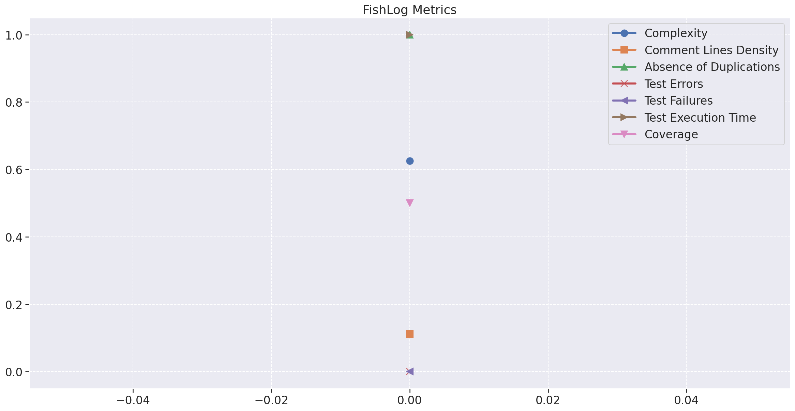

### Repositório *FishWiki*

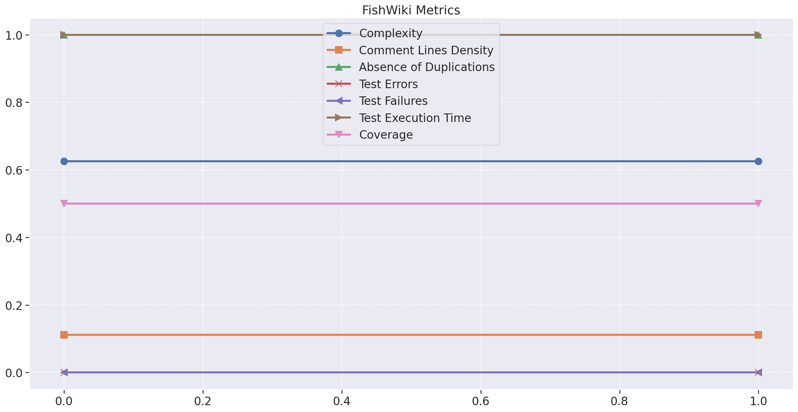

### Repositório *User*

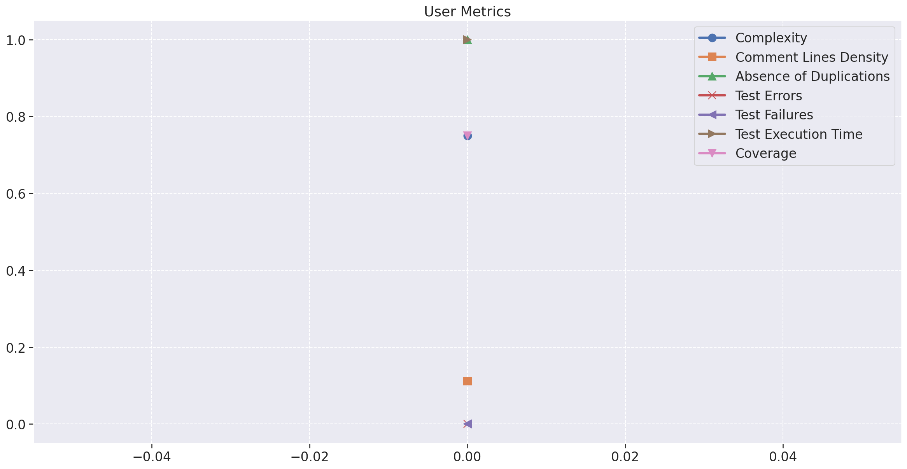

### Repositório *UserInterface*

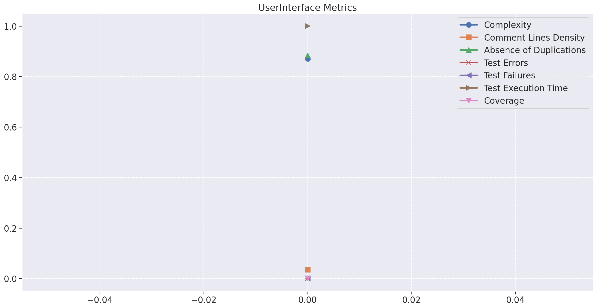

### Qualidade de Código

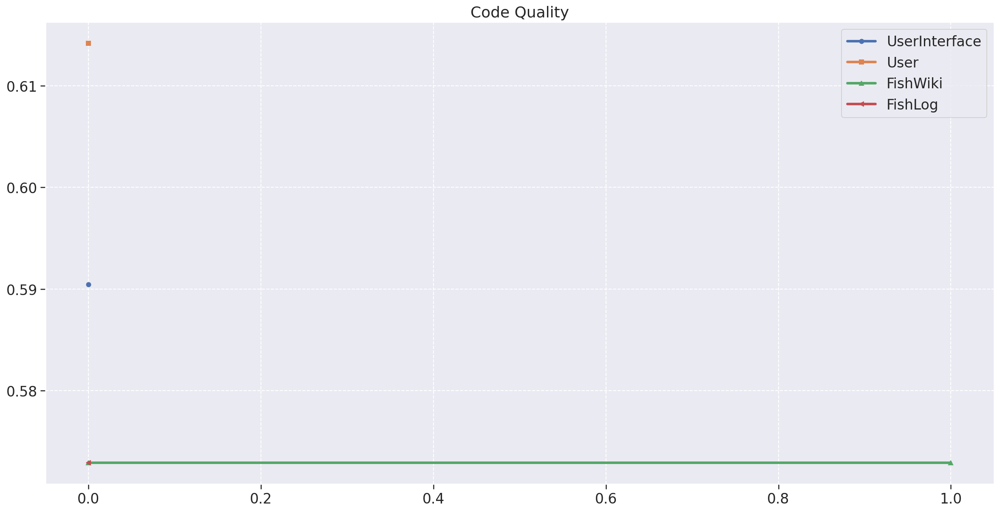

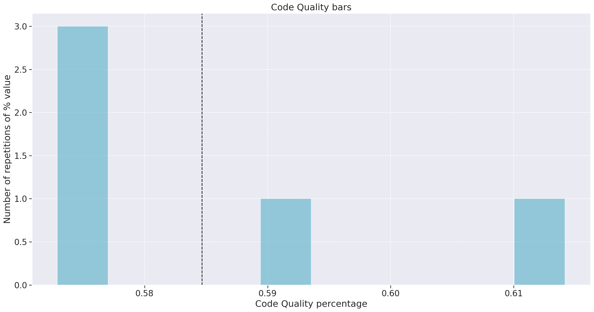

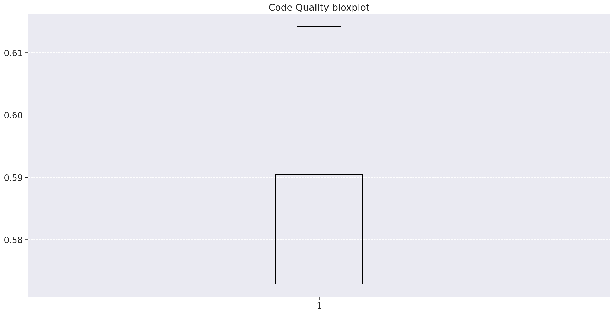

### Status dos Testes

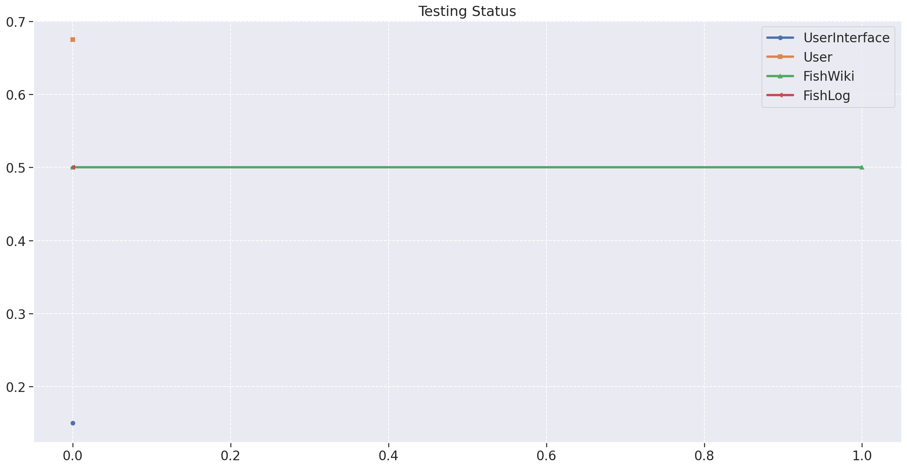

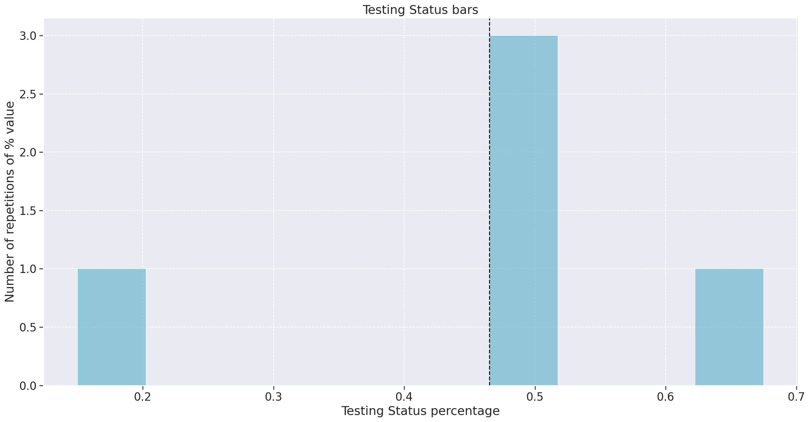

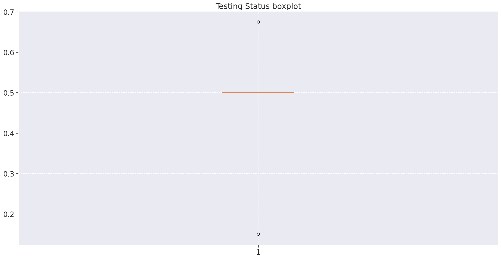

### Total Qualidade do Produto

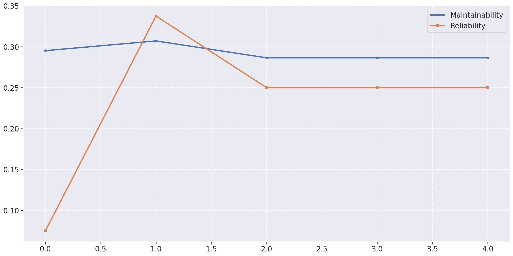

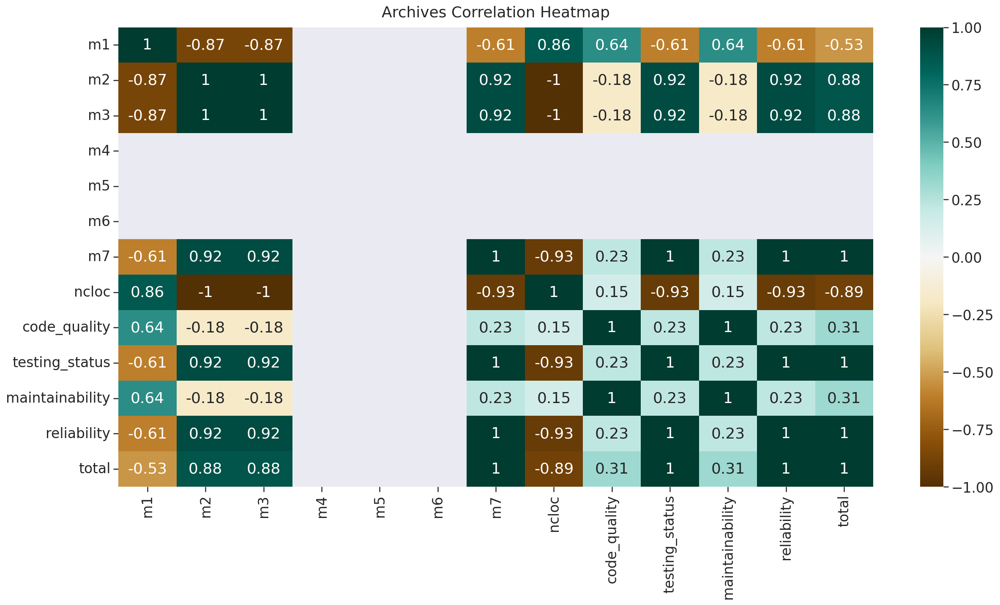

## Valores Numéricos

Os valores numéricos dos dados utilizados para montar os gráficos pode ser vistos no arquivo [fga-eps-mds-Eu-Pescador-DATASET-2022-03-18.csv](https://github.com/fga-eps-mds/2021-2-Eu_Pescador-Doc/blob/main/analytics/data/fga-eps-mds-Eu-Pescador-DATASET-2022-03-18.csv)