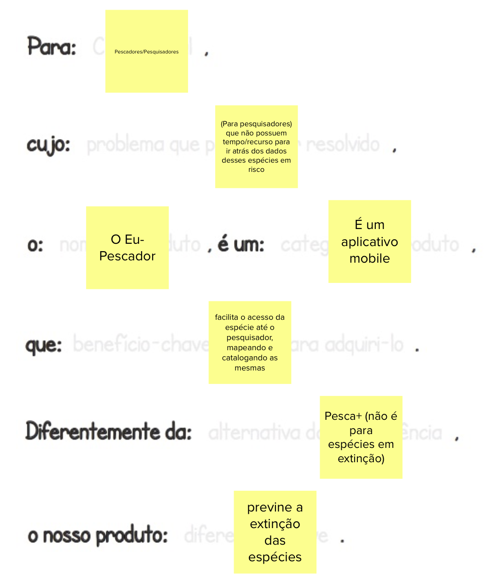

# Visão de Produto

|    Data    | Versão |                Descrição                |                     Autor                     |
| :--------: | :----: | :-------------------------------------: | :-------------------------------------------: |
| 13/03/2022 |  1.0   | Criação do Documento de Visão de Produto | [Dâmaso Júnio](https://github.com/juniopereirab) |

## Metodologia

Para conseguirmos extrair a visão de produto necessária para o desenvolvimento do projeto foi utilizada a metodologia Lean Inception de Paulo Carolli. Com isso desenvolvemos as seguintes etapas.

### Kickoff e Agenda

Essa reunião está referenciada nesse [documento](../Project/Atas/09-02-2022.md), nessa etapa foi apresentado todo o projeto e seu propósito principal para que assim pudesse ser evidenciado o objetivo final que deve-se alcançar. Organizando então a agenda da seguinte forma:

### Visão do Produto

O time desenvolveu então a seguinte visão de produto a partir do que nos foi apresentado:

### Lista É / Não é

O grupo então se dividiu em dois para que fosse feito cada etapa com 2 visões e discurssões diferentes.

### Objetivos do Negócio

Partindo assim para o objetivo do negócio onde cada integrante da equipe, pensou em 3 objetivos específicos para compor todos os objetivos do projeto.

Gerando então a separação por cada Cluster identificado.

### Personas

Foram identificadas 3 personas de usuários para o aplicativo:

- Usuários pescadores (1)
- Usuários pesquisadores (2)
- Usuários administradores (3)

### Jornadas de Usuário

De acordo com cada persona, foi produzida sua respectiva Jornada de Usuário:

### Brainstorm de Funcionalidades

Foi desenvolvido com o conjunto do time, todo o Brainstorm de funcionalidades com as funcionalidades presentes no aplicativo. Como o produto já estava desenvolvido, foi colocado em CINZA todas as atividades cujo o desenvolvimento já havia sido feito. Focando apenas em funcionalidades que ainda não estava presentes no aplicativo:

### Revisão Técnica (Esforço, Negócio, UX)

Foi levantado então as seguintes atividades com seus respectivos valores de Esforço, Valor de Negócio e Valor para UX.

### Sequenciador

Em conjunto com o cliente Oscar, foi priorizado todas as atividades para que fossem desenvolvidas sequenciamente:

### Canva MVP

Por fim, finalizando com o Canva MVP para o projeto

## Mural

<iframe src='https://app.mural.co/embed/49b21d09-3465-4832-986b-762e31f82741'
        width='100%'
        height='480px'
        style='min-width: 640px; min-height: 480px; background-color: #f4f4f4; border: 1px solid #efefef'
        sandbox='allow-same-origin allow-scripts allow-modals allow-popups allow-popups-to-escape-sandbox'>
</iframe>