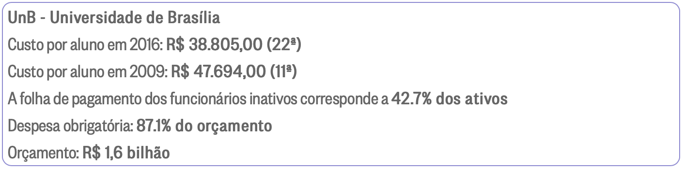

# Estimativa de Custos

|    Data    | Versão |                Descrição                |                     Autor                     |
| :--------: | :----: | :-------------------------------------: | :-------------------------------------------: |
| 05/03/2022 |  1.0   | Criação do Documento de Gestão de Custo | [Letícia Araújo](https://github.com/leticiaarj) e [Dâmaso Júnio](https://github.com/juniopereirab) |
| 13/03/2022 |  2.0   | Edição do Documento de Gestão de Custo | [Dâmaso Júnio](https://github.com/juniopereirab) |

## Planejamento financeiro

Para estimativa de custos, têm-se o uso de algumas referências como forma de cálculo da planilha apresentada abaixo, sendo assim, será exemplificado para um dos pontos com suas respectivas referências.

**Energia Elétrica:** para o cálculo da mesma, foi utilizado o valor média por kWh, que varia de R$ 0,85 à R$ 0,92. De acordo com o [NGSolar](https://www.ngsolar.com.br/single-post/preco-kwh-cpfl), considerando o contexto de 2021. Utilizando como média também o custo de energia médio dos membros do grupo, foi calculado um consumo aproximado de 150 kWh / mês. Com isso foi feito o seguinte cálculo:

> ((150 * 0,90) / Quantidade de horas do mês) * Horas trabalhadas na sprint * Quantidade de membros do projeto.

Com isso têm-se:

> ((150 * 0,90) / 720) * 10 * 11 = R$ 20,62

Obs.: Foi considerado o mês com 30 dias.

**Internet:** para o cálculo da Internet, foi utilizado a seguinte lógica. R$ 150,00 como valor médio de um plano de internet em Brasília. Com isso têm-se:

> (150 / Quantidade de semanas de um mês) * Quantidade de membros do projeto

Assim:

> (150 / 4) * 11 = R$ 412,50

Obs.: Foi considerado a quantidade de semanas e não as horas trabalhadas visto que podem ser utilizadas quaisquer horas para serem trabalhadas e dependendo do trafego da conexão isso pode prejudicar o desenvolvimento do projeto e a conexão entre os membros, sendo necessária a conexão 24/7 da internet no período de uma sprint (5 dias utéis).

**Equipamento de uso pessoal:** para o cálculo desse item, foi utilizado como média o valor de um computador pessoal que será utilizado para o desenvolvimento do projeto com o valor de R$ 3.500,00. Visto que é necessário um computador com configuração mínima para execução do ambiente de desenvolvimento. Com isso têm-se:

> 3500 * 11 = R$ 38.500,00

**Infraestrutura:** isso foi considerado o valor base para disponibilização do aplicativo nas lojas de aplicativos, PlayStore e AppStore. Sendo assim foi calculado o valor de ambos:

> Play Store = US$ 25,00 => R$ 126,88 (De acordo com a cotação do dolar no dia 13/03/2022 às 18:33)
> App Store = US$ 99,00 => R$ 502,42 (De acordo com a cotação do dolar no dia 13/03/2022 às 18:34)

**Pessoal:** como discutido com a equipe cada sprint será desenvolvida com 10 horas disponibilizadas por cada estudante. Sendo assim em um espaço de 5 dias, serão utilizadas 2 horas diárias para o desenvolvimento. O cálculo valor / hora utilizado foi baseado nos valores apresentados pelo [Infográfico do O Globo](https://infograficos.oglobo.globo.com/brasil/raio-x-do-custo-por-aluno-nas-universidades-federais.html) que conta com informações sobre universidades públicas de todo o Brasil.

A partir do valor de R$ 38.805,00 anual, que é o custo por estudante universitário federal. Foi feito o seguinte cálculo para se obter o valor da hora.

> (38805 / Quantidade dos meses em um ano) / Quantidade de horas de um mês * Quantidade de horas trabalhadas por sprint * Quantidade de membros no projeto

Com isso, têm-se:

> (38805 / 12) / 720 * 10 * 11 = R$ 494,05

## Planilha de Custos

<iframe width="750" height="450" frameborder="0" src="https://docs.google.com/spreadsheets/d/e/2PACX-1vTT-Yzzdv8vfTUU2FpXkc3kolSifxtFO5yfisyoHCqK4jBo9D-tFcIKhCHiDzKrUPsI5MVroH2SuJ7K/pubhtml?widget=true&amp;headers=false"></iframe>

Acesse a planilha nesse [link](https://docs.google.com/spreadsheets/d/1iqZn7ZvSsIQMQHjftlmypp0A67Jklt-9vlWK7pEAr-M/edit?usp=sharing)